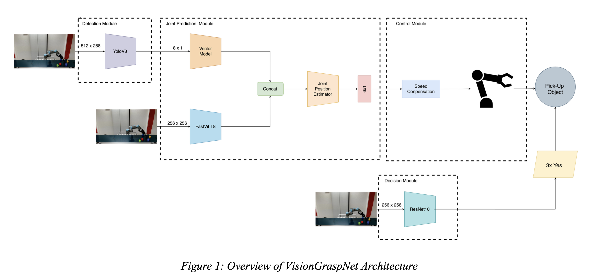

# VisionGraspNet: Automated Object Identification and Retrieval System


VisionGraspNet is an advanced system designed to optimize the performance of robotic arms in automated object identification and retrieval, specifically tailored for conveyor belt applications. This project, developed as part of a Master's Thesis in Information Systems, integrates state-of-the-art computer vision models with robotic control to create a flexible and efficient automation solution.

The system is capable of operating in both **static** (stationary objects) and **dynamic** (moving conveyor belt) scenarios, providing a robust solution for modern logistics and supply chain challenges.

## Abstract

The demand for automation in various industries has increased significantly over the last few years, particularly in logistics, and has driven the demand for efficient object identification and retrieval systems. This project involved designing and developing an advanced automated object identification and retrieval system capable of accurately and efficiently identifying and picking up objects from a conveyor belt. The developed system, VisionGraspNet, leverages state-of-the-art computer vision models like YOLOv8 and FastViT, which enable precise prediction of object positions and facilitate seamless retrieval. To assess the proposed system's performance, comprehensive experiments were conducted to quantify its accuracy, speed, and robustness across various scenarios.

## System Architecture: VisionGraspNet

The VisionGraspNet architecture is a modular framework that integrates vision systems, robotic arms, and artificial intelligence to enhance functionality and performance. It consists of four key components:



_Figure 1: High-Level Overview of the VisionGraspNet Architecture_

1.  **Detection Module:** This module employs a **YOLOv8** model to accurately detect and identify objects on the conveyor belt in real-time. It processes the video feed and extracts the class and bounding box coordinates for each identified object.

2.  **Joint Positioning Module:** This is the core intelligence of the system. It uses a multimodal neural network to predict the precise 6-dimensional joint positions required for the robotic arm to grasp an object. It takes two inputs:
    *   An image of the scene.
    *   An 8-dimensional vector representing the object's bounding box (`xywh` and `xyxy` formats).
    The module uses a **FastViT (Fast Hybrid Vision Transformer)** as a feature extractor for the image and a custom vector model for the bounding box data. The features are then fused to predict the final joint positions.

3.  **Decision Module:** Acting as the decision-making heart, this module uses a binary image classifier (**ResNet10**) to determine the optimal moment to grasp. It analyzes the visual input and classifies the frame as "grab" or "not grab". To ensure reliability, a grasp is only initiated after three consecutive "grab" predictions.

4.  **Control Module:** This module handles real-time communication with the UR3e robotic arm using the `ur-rtde` library.
    *   In **dynamic mode**, it continuously sends `servoJ` commands based on the predictions from the Joint Position Module. It also applies a **speed compensation** factor to the target coordinates to counteract the conveyor belt's motion, ensuring the gripper accurately tracks the moving object.
    *   In **static mode**, it sends a single `moveJ` command to position the arm for pickup.

## Key Features

-   **Dual-Mode Operation**: Seamlessly switch between static and dynamic modes for versatile applications.
-   **High-Accuracy Object Detection**: Utilizes a fine-tuned YOLOv8 model for robust object identification.
-   **Advanced Pose Estimation**: Employs a novel FastViT-based multimodal architecture to predict precise robot joint positions from 2D camera images.
-   **Intelligent Grasping Logic**: A dedicated Decision Module determines the perfect moment to grasp, increasing success rates in dynamic environments.
-   **Real-Time Speed Compensation**: Dynamically adjusts the robot's target to intercept objects on a moving conveyor belt.
-   **Comprehensive Web Dashboard**: An intuitive user interface for remote monitoring and control.

## Demo Application: The RoboRetriever Interface

For easy handling and monitoring, VisionGraspNet includes the **RoboRetriever** web dashboard. This interface allows a user to connect to, control, and visualize the entire robotic system remotely.

<video controls width="720">
    <source src="docs/Demo.mp4" type="video/quicktime">
    Your browser does not support the video tag. Download the demo: [Demo.mov](docs/Demo.mov)
</video>

_Figure 2: The RoboRetriever Web Interface (demo video)_

The dashboard provides:
-   **Live Video Feed:** A real-time stream from the camera observing the workspace.
-   **Robot Control Panel:** Buttons to connect/disconnect the robot, start/stop the processing loop, move to a base position, and set a drop-off point using free-drive mode.
-   **Mode Selection:** Easily select objects and models, set conveyor speed, and switch between Static and Dynamic modes.
-   **Live Status Updates:** See the connection status of the robot and gripper, operational mode, and currently selected object.
-   **Performance Analytics:** Live-updating charts that visualize:
    -   **Pick-up Locations:** A scatter plot showing the coordinates of successful grasps.
    -   **Dynamic Grasping Time:** A line chart tracking the time from detection to pickup.
    -   **Object Counts:** A bar chart summarizing the number of each object type retrieved.
-   **Key Performance Indicators (KPIs):** A stats panel showing overall success rates, static/dynamic success rates, and average grasping time.

## Technology Stack

| Category      | Technologies                                                                                             |
| :------------ | :------------------------------------------------------------------------------------------------------- |
| **Hardware**  | Universal Robots UR3e, Robotiq E-Hand Gripper, Logitech c920 Webcam, Conveyor Belt                       |
| **Backend**   | Python, Flask, PyTorch, Ultralytics (YOLOv8), `timm`, OpenCV, `ur-rtde`, `roboticstoolbox-python`           |
| **Frontend**  | Next.js, React, Tailwind CSS, Tremor, Recharts                                                           |
| **Deployment**| `bore` (for TCP tunneling to expose the local Flask server)                                              |

## Setup and Installation

These instructions are based on the "Dashboard Instructions" annex from the thesis.

### Prerequisites

-   Git
-   Python 3
-   Node.js
-   Homebrew (for macOS users to install `bore`)

### 1. Clone the Repository

```sh
git clone https://github.com/matthiaspetry/VisionGraspNet.git
cd VisionGraspNet/
```

### 2. Install Dependencies

You will need three separate terminal windows for the installation and operation.

**Terminal 1: Backend Dependencies**

```sh
# Navigate to the RoboRetriever directory
cd RoboRetriever/
pip install -r requirements.txt
```

**Terminal 2: Frontend Dependencies**

```sh
# Navigate to the frontend directory
cd RoboRetriever/frontend/
npm install
```

**Terminal 3: Bore CLI** (for remote access)

```sh
# On macOS
brew install bore-cli

# On other systems, follow the official installation guide for `bore`
```

## Running the Application

### 1. Hardware Setup

-   Connect both webcams to your computer.
-   Power up the UR3e Robot Arm and start it.
-   Set the robot arm to **"Remote Mode"** to allow control via Python.

### 2. Launch Services

Open three separate terminal windows.

**Terminal 1: Start the `bore` Tunnel**
This exposes your local Flask server to a public URL so the frontend can reach it.

```sh
# This command is found in RoboRetriever/
./ngrok http 5000
```
Keep this terminal running. It will display a public URL like `https://<random-string>.ngrok-free.app`. **Copy this URL.**

**Terminal 2: Start the Flask Backend**

```sh
# Navigate to the RoboRetriever directory
cd RoboRetriever/
flask run
```

**Terminal 3: Start the Next.js Frontend**

```sh
# Navigate to the frontend directory
cd RoboRetriever/frontend/
npm run dev
```

### 3. Operating the Robot Arm

1.  Access the frontend in your browser at **`http://localhost:3000`**.
2.  An overlay will appear asking for a URL. Paste the **ngrok URL** you copied earlier.
3.  Click **"Connect Robot"** on the dashboard to initialize the connection with the UR3e arm and gripper.
4.  **Static Mode:**
    -   Ensure the switch in the top-right is set to "Static".
    -   Select the model and the object you wish to pick up.
    -   Click **"PickUp Object"**. The robot will identify the object and retrieve it.
5.  **Dynamic Mode:**
    -   Flick the switch to "Dynamic".
    -   Select the object type and the conveyor belt speed.
    -   Click **"Start Processing"**. The robot will continuously look for the selected object on the moving conveyor and attempt to pick it up.

